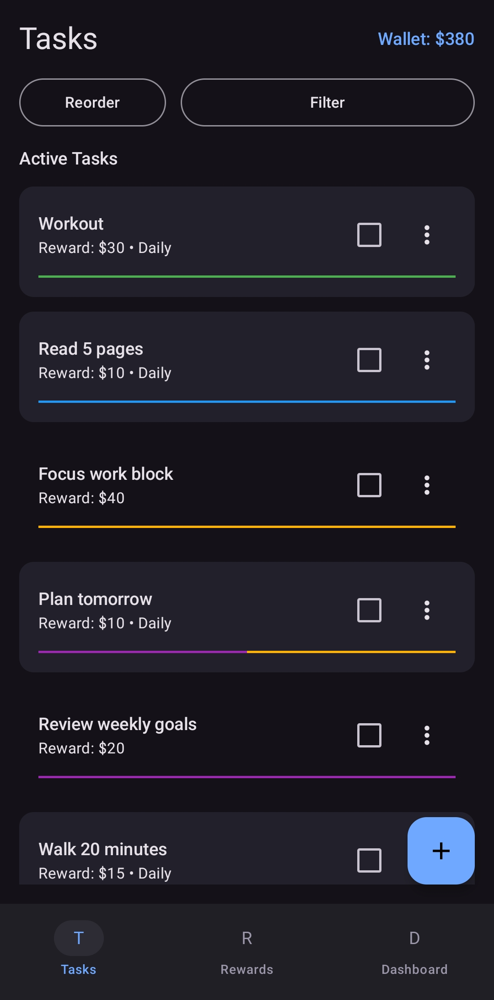
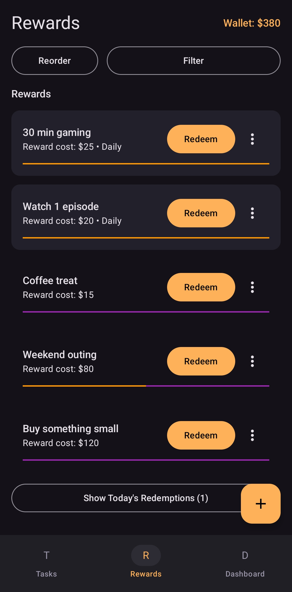
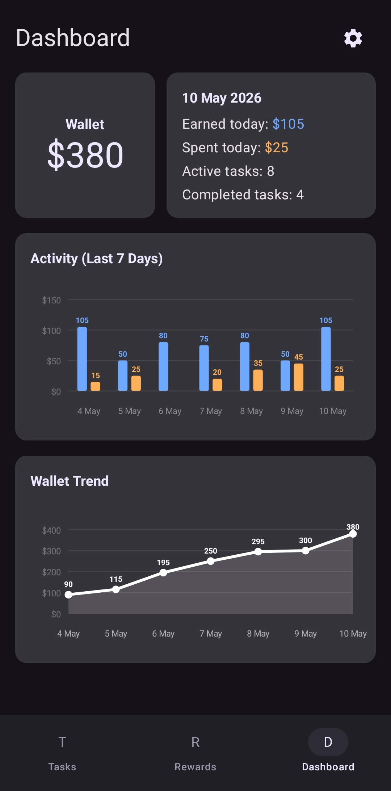
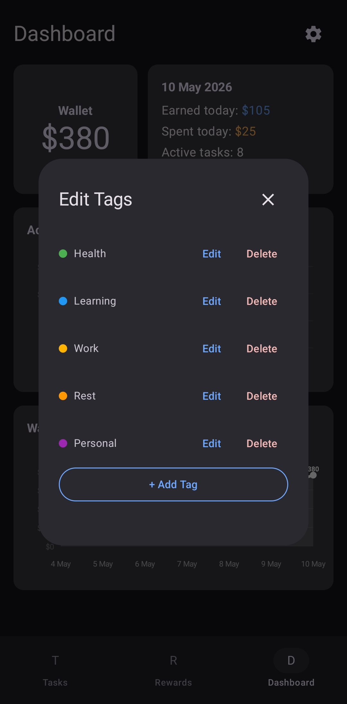

# SelfMint

<!-- BEGIN SELF-MINT DESCRIPTION -->
| | |
|---|---|
| SelfMint is a gamified productivity app that lets you create your own “behavioral economy”: complete tasks to earn currency, then spend that currency on rewards you define.  This repo currently still contains some legacy naming from an earlier project title (“Habit Currency”), including the internal package name `com.ravaroj.habitcurrency`. |  |
<!-- END SELF-MINT DESCRIPTION -->

## Screenshots

| | |
|---|---|
|  |  |
|  |  |

## What You Can Do

- **Tasks (One-Time + Daily)**: Daily habits regenerate; one-time tasks can carry forward if left incomplete.
- **Repeatable Daily Completions**: Repeat a completed daily task to earn again (tracked via `claimCount`).
- **Rewards (One-Time + Daily)**: Redeem rewards with currency; daily rewards stay available, one-time rewards disappear on redemption.
- **Reversible by Design**: Uncomplete tasks, undo redemptions, and edit flows keep the wallet consistent.
- **Daily Rollover + Cleanup**: On app start, the app processes the day change and prunes older history.
- **Dashboard**: Visualizes earned vs spent activity and wallet trend.
- **Tags**: Add colored tags to organize tasks (reward tag support is in progress).

## Download (APK)

I publish signed builds on GitHub Releases.

- Go to the latest release and download the APK.
- Install on your device (you may need to allow “install unknown apps” for your browser/files app).

## Tech Stack

- Kotlin, Jetpack Compose (Material 3)
- Room, DataStore
- Coroutines / Flow
- Navigation Compose

## Development

1. Clone the repository.
2. Open in Android Studio (Ladybug or newer recommended).
3. Sync Gradle and run on an emulator or physical device.
